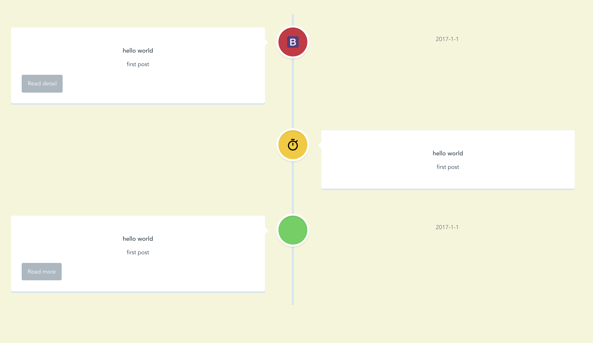
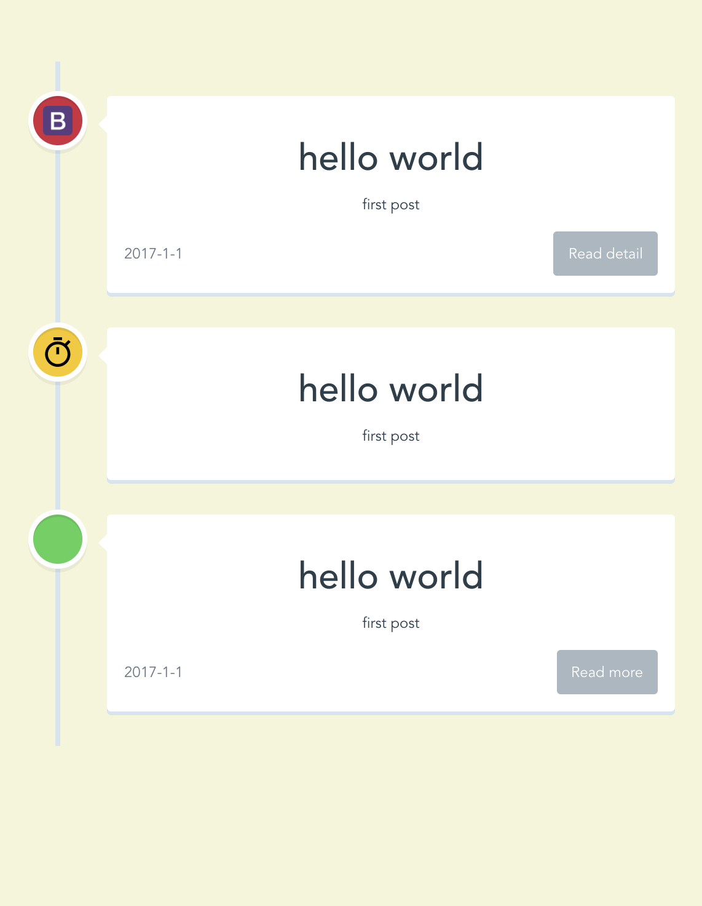

# Vue-timeline

It just a simple time line component for vue 2.0  
source code from [click me!](http://www.helloweba.com/view-blog-285.html)

* Data from json
* Responsive




## Requirement

* npm
* vue2.0.1+
* bootstrap3

That's all. 


## Installation
1. Binding properties
```
<timeLine :points="points"></timeLine>
```
2. Config the points (all can be ignored)
```
points: [
          {
            pointColor: 'red', // important! the color of every time point and you can use red yellow or green *关键点颜色 可选red yellow green
            img: 'http://www.jikexueyuan.com/event/static/images/bootstrap/bootstrap-logo.png', // img url for every time point 图片地址 可留空
            title: 'hello world', // important! title *时间点标题
            text: 'first post', // important! the content you want show *时间点内容
            linkUrl: 'https://www.google.com', // url for read more 链接url 留空则不显示按钮
            linkText: 'Read detail', // show what in read for more button 按钮显示内容 默认为Read more
            date: '2017-1-1' // time of the point 时间点
          }
        ]
```
3. Get the current time point's all parameters you write
```
<timeLine @currentPoint="your function"></timeLine>
```


## Custom
Incoming


To Do List
----------

- config for max showing points
